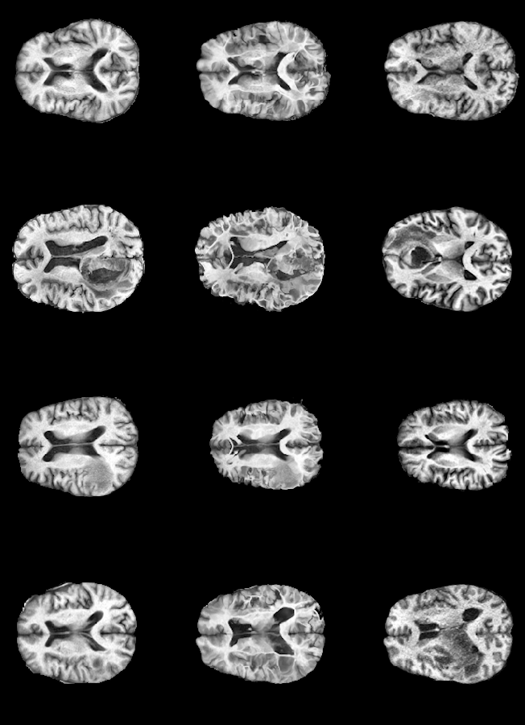

# DEEPALI-IMAGE-REGISTRATION

## Introduction

Image registration is a fundamental task in medical image analysis, involving the spatial alignment of two or more images. It's crucial for various applications, including disease progression monitoring, multi-modal analysis, and population studies. This project implements an unsupervised image registration network inspired by VoxelMorph, using the DeepALI framework.

The main goals of this project are:
1. To provide a flexible and efficient implementation of unsupervised image registration for medical imaging.
2. To compare the performance of our DeepALI-based implementation with the original VoxelMorph implementation.

This repository contains two main training scripts:
1. `train_mri.py`: Our implementation using the DeepALI framework.
2. `train_voxelmorph.py`: The original VoxelMorph implementation in TensorFlow.

Both scripts use the `config.ini` file for parameter configuration, allowing easy experimentation and comparison between the two implementations.

## Table of Contents
1. [Project Structure](#project-structure)
2. [Requirements](#requirements)
3. [Environment Setup](#environment-setup)
   - [Python Virtual Environment](#python-virtual-environment)
   - [Conda Environment](#conda-environment)
4. [Installation](#installation)
5. [Usage](#usage)
   - [DeepALI Implementation](#deepali-implementation)
   - [VoxelMorph Implementation](#voxelmorph-implementation)
6. [Configuration](#configuration)
7. [Results](#results)
8. [References](#references)
9. [License](#license)

## Project Structure

```
DEEPALI-IMAGE-REGISTRATION
├── data
│   └── ixi_t2_dataset_cropped.npy
├── src
│   ├── classes
│   │   ├── dataset.py
│   │   ├── losses.py
│   │   ├── metrics.py
│   │   └── model.py
│   ├── scripts
│   │   ├── data_generation_brats.py
│   │   ├── data_script_new.py
│   │   └── data_script.py
│   ├── train_mri.py
│   └── train_voxelmorph.py
├── .gitignore
├── config.ini
├── LICENSE
├── README.md
├── requirements_tf.txt
└── requirements.txt
```

## Requirements

- For the DeepALI implementation: See `requirements.txt`
- For the original VoxelMorph implementation: See `requirements_tf.txt`

## Environment Setup

### Python Virtual Environment

1. Create a new virtual environment:
   ```
   python -m venv deepali_env
   ```

2. Activate the virtual environment:
   - On Windows:
     ```
     deepali_env\Scripts\activate
     ```
   - On macOS and Linux:
     ```
     source deepali_env/bin/activate
     ```

3. Install the required packages:
   ```
   pip install -r requirements.txt
   ```

### Conda Environment

1. Create a new Conda environment:
   ```
   conda create --name deepali_env python=3.8
   ```

2. Activate the Conda environment:
   ```
   conda activate deepali_env
   ```

3. Install the required packages:
   ```
   pip install -r requirements.txt
   ```

## Installation

Clone the repository and navigate to the project directory:

```
git clone https://github.com/your-username/DEEPALI-IMAGE-REGISTRATION.git
cd DEEPALI-IMAGE-REGISTRATION
```

## Usage

### DeepALI Implementation

To run the DeepALI-based implementation:

```
python src/scripts/train_mri.py
```

This script uses the DeepALI framework to train an unsupervised image registration network.

### VoxelMorph Implementation

To run the original VoxelMorph implementation:

1. Create a separate environment (optional but recommended):
   ```
   python -m venv voxelmorph_env
   source voxelmorph_env/bin/activate  # On Windows, use: voxelmorph_env\Scripts\activate
   ```

2. Install the TensorFlow-specific requirements:
   ```
   pip install -r requirements_tf.txt
   ```

3. Run the VoxelMorph training script:
   ```
   python src/scripts/train_voxelmorph.py
   ```

This script uses the original VoxelMorph architecture using TensorFlow.

## Configuration

Both implementations use a `config.ini` file for parameter configuration. The file is divided into two sections: `[pytorch]` for the DeepALI implementation and `[tensorflow]` for the original VoxelMorph implementation.

### DeepALI Implementation Parameters

- `grid_size_x`: Width of the input images
- `grid_size_y`: Height of the input images
- `batch_size`: Number of samples per batch for training
- `train_val_split`: Ratio of training data to validation data 
- `val_test_split`: Ratio of validation data to test data 
- `nb_epochs`: Number of training epochs 
- `learning_rate`: Learning rate for the optimizer 
- `loss`: Loss function used for training 
- `loss_weight`: Weight applied to the loss function 
- `images_path`: Path to the input image dataset
- `seg_path`: Path to the segmentation dataset 
- `weights_path`: Path to save or load model weights

### VoxelMorph Implementation Parameters

- `batch_size`: Number of samples per batch for training 
- `train_val_split`: Ratio of training data to validation data 
- `val_test_split`: Ratio of validation data to test data 
- `int_steps`: Number of integration steps for the diffeomorphic model 
- `lambda_param`: Lambda parameter for loss weights
- `steps_per_epoch`: Number of steps (batches) per epoch 
- `nb_epochs`: Number of training epochs
- `verbose`: Verbosity mode (1 - display progress bar)
- `loss`: Loss function used for training 
- `grad_norm_type`: Type of gradient normalization 
- `gamma_param`: Weight of the dice loss 
- `learning_rate`: Learning rate for the optimizer 
- `images_path`: Path to the input image dataset
- `weights_path`: Path to save or load model weights 

To modify these parameters, edit the `config.ini` file in the root directory of the project. The scripts will automatically load these parameters when running.

Note: Ensure that the paths to datasets and weight files are correct and accessible from your working directory.

## Results

This section presents the results of our image registration experiments using both the DeepALI-based implementation and the original VoxelMorph implementation.

### Quantitative Results

Below, the two table can be seen demonstrating the quantitative comparison of two models.


### Qualitative Results

Below, an example registration can be seen using one of the BraTS datasets. It is important to note that the left images represent the Source (Moving), the middle ones Transformed(Moved), and the right ones Target(Fixed).



## References

1. IXI Dataset: Information eXtraction from Images (IXI) dataset. Available at: https://brain-development.org/ixi-dataset/

2. OASIS Dataset: Open Access Series of Imaging Studies (OASIS). Available at: https://www.oasis-brains.org/

3. BRATS Dataset: Multimodal Brain Tumor Segmentation Challenge (BraTS). Available at: https://www.med.upenn.edu/cbica/brats2021/

4. Balakrishnan, G., Zhao, A., Sabuncu, M. R., Guttag, J., & Dalca, A. V. (2019). VoxelMorph: A Learning Framework for Deformable Medical Image Registration. IEEE Transactions on Medical Imaging, 38(8), 1788-1800.

5. VoxelMorph GitHub Repository: https://github.com/voxelmorph/voxelmorph

## License

This project is licensed under the terms of the LICENSE file included in the repository.